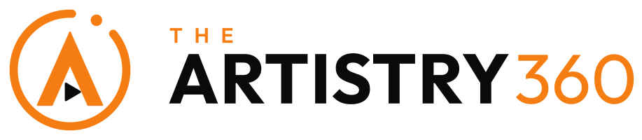

# The Artistry360 Brand: Logo

Approved 29 September 2026. **One logo, Orbit A, for everything**: theartistry360.com, the Studio, voting, stream.theartistry360.com, the mobile app, print and social (Client decision, Mr. Alexon Audax Mulookozi).



A bold A inside an open orbit that completes the 360. The counter of the A is a play button (film and streaming); the dot at the end of the orbit is movement, an artist going all the way round.

## Where the files are

The logo files live in **`public/brand/`**, so the site can serve them (for example `/brand/logo/svg/artistry360-logo-horizontal-on-dark.svg`). This folder only holds the guide and the concept history.

```
public/brand/
  logo/svg/        vector masters, use these first
  logo/png/        transparent PNGs, file name ends in the pixel height
  wordmark/        "THE ARTISTRY360" on its own
  Artistry360_Logos.zip   everything above, to send to printers, press and partners
public/            favicons, app icons and site.webmanifest (see Web icons)
src/components/ui/brand/BrandLogo.jsx   the animated logo used in the UI
docs/brand/        this guide, and the concept PDFs from 29 Sep 2026
```

## Variations

The logo comes in these layouts:

| File part | Layout | Use |
|---|---|---|
| `icon` | Symbol only | Favicons, avatars, app icons, watermarks, small spaces |
| `app-icon` | Symbol on a black rounded square | App stores, social profile pictures |
| `logo-horizontal` | Symbol left, wordmark right | Website navigation, documents, email signatures |
| `logo-horizontal-tagline` | Adds "Acting Academy · Kampala" | Letterheads, posters, the academy website |
| `logo-stacked` | Symbol above wordmark | Square spaces, end cards, banners, merchandise |
| `logo-stacked-tagline` | Stacked with tagline | Posters, certificates |

And these colourways:

| File part | Colours | Background |
|---|---|---|
| `on-dark` | Orange mark, cream wordmark, orange "THE" and "360" | Black or dark photos (default) |
| `on-light` | Orange mark, black wordmark, orange "THE" and "360" | White or light backgrounds |
| `white` | All white | One-colour use on dark or busy backgrounds, embroidery |
| `black` | All black | One-colour print, stamps, faxes, engraving |

File names follow `artistry360-<layout>-<colourway>`, for example `artistry360-logo-horizontal-on-dark.svg`. The symbol alone is `artistry360-icon-<colourway>`.

## Colours

| Name | HEX | RGB | Token |
|---|---|---|---|
| Artistry Orange | `#F67D12` | 246, 125, 18 | `--color-brand` |
| Warm Black | `#0B0A09` | 11, 10, 9 | `--color-surface-secondary` |
| Cream | `#FAF7F2` | 250, 247, 242 | `--color-text-primary` |
| Pure Black | `#000000` | 0, 0, 0 | `--color-surface-primary` |

Orange appears only on the mark and on "THE" and "360". The rest of the wordmark is cream on dark and black on light.

## Type

- Wordmark: **Outfit** (Bold for ARTISTRY, Regular for 360, SemiBold tracked for THE and the tagline). The letters are converted to outlines in every logo file, so the font is not needed to use the logos. Outfit is free under the SIL Open Font License.
- Websites and apps: **Quicksand**, as set in `src/index.css`.

## Clear space and minimum size

- Keep clear space around the logo equal to **a quarter of the symbol's height** on every side. Nothing else (text, edges, other logos) goes inside it.
- Horizontal logo: at least **120 px wide** on screen or **30 mm** in print.
- Symbol: at least **24 px** on screen. At 16 px (favicon) the play button is dropped; this simplified version is already in the favicon files.

## Do not

- Stretch, squash, rotate or skew the logo.
- Recolour it outside the four colourways above, or add gradients, shadows or outlines.
- Put the orange mark on an orange or busy background; use the `white` or `black` version instead.
- Rebuild the wordmark in another font or change the spacing.
- Replace the play button with another shape, or move the orbit dot.
- Use the old script "The artistry realisation" logo anywhere.

## Animation

In the websites the logo is drawn inline by `BrandLogo` (`src/components/ui/brand/`), styled in `src/index.css` under **Brand Logo**:

1. The orbit draws itself clockwise (1 s).
2. The A rises into place and the play button pops in.
3. THE, ARTISTRY and 360 rise one after another.
4. The orbit and its dot turn a full 360 once, then rest.
5. Hovering the logo (or the link around it) turns the orbit 360 again.

Use `<BrandLogo intro />` where the page first loads (navbars) and `<BrandLogo />` elsewhere. Under reduced motion it is static. For video, email or other sites, `public/brand/logo/svg/artistry360-logo-animated.svg` plays the same intro on its own.

## Where the logo moves

| Moment | Site | What happens | Code |
|---|---|---|---|
| First load | Both | Black splash: the orbit draws in, the A rises, the play button pops, then it fades as the app appears. Full draw only on the first visit of a session; later visits show a turning orbit only while loading. | `index.html` (#splash), hidden by `src/main.jsx` |
| Page and data loading | Both | The orbit turns while the A holds still. Fades in after 150 ms, so fast loads show nothing. | `PageLoader` → `BrandMark motion="spin"` |
| Navbar | Both | The full logo plays its entrance once, and turns 360 on hover. | `BrandLogo intro` |
| Studio session check | Website | Full screen "Studio · Opening the Studio" with the turning orbit. | `StudioSplash` in `RequireAuth` |
| Studio sign-in | Website | After a correct password: "Welcome, {name}", the orbit turns once, then the dashboard opens (1.3 s). | `studio-login.jsx` |
| Before a film | Stream | 1.5 s sting: the orbit draws, the play button presses, the film starts. Once per title per session; never on resume, never before an ad. | `PlayerSting`, rules in `player/sting.js` |
| Buffering | Stream | The turning orbit over the picture until frames arrive. | `Player.jsx` |

All of it stops under reduced motion: the logo simply appears.

## Web icons

Both repos use the same file set in `public/`:

| File | Size | Purpose |
|---|---|---|
| `favicon.ico` | 16, 32, 48 | Older browsers, Windows |
| `favicon.svg` | vector | Modern browsers |
| `favicon-16x16.png`, `favicon-32x32.png` | 16, 32 | PNG fallbacks |
| `apple-touch-icon.png` | 180 | iPhone and iPad home screen |
| `android-chrome-192x192.png`, `android-chrome-512x512.png` | 192, 512 | Android and PWA |
| `maskable-icon-512x512.png` | 512 | Android adaptive icons (safe zone respected) |
| `site.webmanifest` | | App name, colours and icon list |

Both sites use the same icons; only the manifest name differs (The Artistry360, Artistry360 Stream). `index.html` links all of them. To regenerate, use the logo scripts kept by Raijin Tech Hub; do not edit the PNGs by hand.
